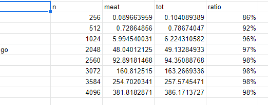
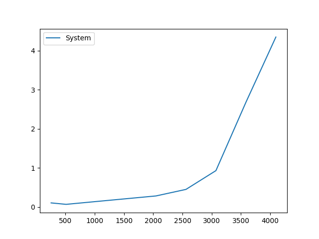

# Generate all the temporary files 

## Generate temp files for x_86
```bash
gcc --save-temps matrix_mul_int_x86.c -o matrix_mul_int_x86.out
```

## Generate temp files for mips
The cross-compiled tool used here is 
`mips-linux-gnu-gcc` on X-86 platform for MIPS platform

```bash 
mips-linux-gnu-gcc --version
```
mips-linux-gnu-gcc (Ubuntu 9.4.0-1ubuntu1~20.04) 9.4.0

```bash
mips-linux-gnu-gcc --save-temps matrix_mul_int_mips.c -o matrix_mul_int_mips.out
```


# File information

## Stats for the mips compiled files
```bash
~/Sid_computer_system/mips_files$ stat *
```

```bash
File: matrix_mul_int_mips.c
  Size: 682       	Blocks: 8          IO Block: 4096   regular file


  File: matrix_mul_int_mips.i
  Size: 18223     	Blocks: 40         IO Block: 4096   regular file

  File: matrix_mul_int_mips.o
  Size: 3508      	Blocks: 8          IO Block: 4096   regular file

  File: matrix_mul_int_mips.out
  Size: 12044     	Blocks: 24         IO Block: 4096   regular file

  File: matrix_mul_int_mips.s
  Size: 8196      	Blocks: 24         IO Block: 4096   regular file

```

## Stats for x_86 compiled file

```bash
~/Sid_computer_system/x_86_files$ stat *
```
```bash
File: matrix_mul_int_x86.c
  Size: 682       	Blocks: 8          IO Block: 4096   regular file

  File: matrix_mul_int_x86.i
  Size: 16838     	Blocks: 40         IO Block: 4096   regular file

  File: matrix_mul_int_x86.o
  Size: 3800      	Blocks: 8          IO Block: 4096   regular file

  File: matrix_mul_int_x86.out
  Size: 16808     	Blocks: 40         IO Block: 4096   regular file

  File: matrix_mul_int_x86.s
  Size: 8926      	Blocks: 24         IO Block: 4096   regular file

```

## Preprocessed MIPS V/S X_86
> The file size is almost the same. 

> The content in the file is almost same 

The preprocessor do the following tasks: 
 - macro substitution, 
 - testing for conditional compilation directives, 
 - and file inclusion. 

Which are basically same for all platforms

`16838` - x_86 
`18223` - mips

## Compiled code - MIPS V/S X_86
`8926` - x_86
`8196` - mips

> File size are almost the same 

> But the content of the file vary significatly

## Assembled code - MIPS v/s X_86
`3800` - x_86
`3508` - mips

## Binary code - MIPS v/s X_86
`16808` - x_86
`12044` - mips

> The binary files size are very much different.
Mips generate a much more smaller file than the x_86.

This might be due to the different instruction set.

  Intuation: MIPS might have smaller instruction size or set as compared to X_86


> Note: As the code converted to assembled code, the size reduces but the final binary file size increases again

# Whether we can execute the cross-compiled code on native platform?

1. Cross-compilers compile and generate the binary file for some other platform on some particular platform

2. Every platform has there own instruction set architecture, which are generally different form one-another. Example (MIPS and X_86)

3. In our case, we are using x_86 as host machine (on which the cross-compiler is generating binary file) and MIPS as target machine (on which the binary file will execute)

That is why we can not execute the cross-compiled binary code on native platform.

# TIME factors comparisions
## Choice of Languanges for studing time variation

I have choose the GOLANG from bucket 1 and PYTHON from bucket 2. 

The reason behind to choose these language to know the difference of time factor between GO and PYTHON, which are in recent hype in the industry.


## Matrix multiplication - modified

- Genearally, the languages like C, C++, Python, GO, etc uses the   `ROW-MAJOR` to store and access the Multi-Dimension arrays.

- Matrix Multiplication uses the following formula:

`Z[i][j]  = A[i][k] * B[k][j]`
> Evaluation ith row (first) with jth column (second)

- But, for this question I have used the matrix multiplication code with the following formulae:
`Z[i][j]  = A[i][k] * B_transpose[j][k]`.
Where B_transpose is the transpose of Second matrix.
> Evaluation ith row(fist) with jth row(second)

I used the above method to reduce the more frequent cache access time.

Since, the matrix (2-D array) access is row-major in GO and PYTHON. And we have to access the all the row of the second matrix for result calculation of each cell of the resultant matrix.

By taking the transpose of the second matrix 
We are evaluation ith row of first matrix with jth row of second, and we need not to fetch every row(second) for ith row(first)

> This way I am save a large number of memory access time.

## 2.a TIME result
The `time` command return the three value for every command executed on linux.

- real time : It is the wall time for which the code is exected (Not so use full)
- user time : It is the CPU time describing the CPU executed the instruction in USER MODE.
- system time It is the CPU time describing the CPU executed the instruction in KERNEL MODE (servicing interrupts and sys-calls).


### SYSTEM time v/s CPU time of GOLANG-INT code:


### SYSTEM time v/s CPU time of GOLANG-DOUBLE code:


### SYSTEM time v/s CPU time of PYTHON-INT code:


### SYSTEM time v/s CPU time of PYTHON-DOUBLE code:


## 2.B Meat vs Total 

> Meat portion time for the Golang code




> Meat portion time for the Golang code


> In this, my observation is that the meat and Total time ration is increasing with increase in input size.

> But as the input size increases to a very large number the ratio tends to a saturation of `90%`


## 2.C Plot of System and Program time execution 

## Golang


## Python


> Meat portion time for the Golang code


> Meat portion time for the Golang code


### PLOTs for Golang-Int


### PLOTs for Golang-Double





### PLOTs for PYTHON-Int


### PLOTs for PYTHON-Double


## Observation on the different time parameters

- We have observed that the execution time of the program increases `exponentially` with respect to the increase in the input size of the program 

- But the system-cpu time (system calls) does not increases significantly with increase in input size. Rather we see that it tends to a satuaration (not exactly constant but seems constant with respect to input size) point with size.

>  `Meat vs  Total time `

- Initially with smaller inputs, there is a visinle variation in meat algorithm time and total time.

- But as the input size increases, the difference

> The ratio of meat time and total time becomes approx `99%` as the input value becomes very large

### `MEAT`, `TOTAL PROGRAM EXECUTION`, `CPU` time VS `SYSTEM` time

We have oberseved that the meat time, total time, and CPU time increases `exponential slope` whereas the system time increases with very `small slope` value.


